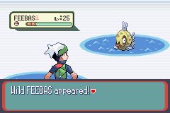

# Feebas Fishing Bot



Introduction text...


## Introduction

Feebas is one of the rarest Pokémon to find in the world of Pokémon. Its rarity stems from the fact that it only appears on a few specific water tiles, chosen randomly in certain locations of the game. These tiles change each day and are notoriously difficult to pinpoint manually. This project was born out of the desire to automate this process, making it easier to find Feebas without the frustration of hours of manual fishing.

The Feebas Fishing Bot automates the process of locating and catching Feebas. It scans the game screen to identify water tiles, systematically fishes every possible tile, and uses advanced techniques like image recognition and grid-based navigation to ensure no spot is missed. If Feebas is encountered, it alerts the user via a phone message with a screenshot for confirmation.

## Key Features
1. **Game Map Scanning**: The bot takes screenshots of the game, detects water tiles, and creates a grid to represent the map.
2. **Pathfinding**: Uses Depth-First Search (DFS) to navigate and fish every water tile at least twice.
3. **Fishing Automation**: Automatically casts the fishing line, detects if a Pokémon was caught, and determines its species.
4. **Real-Time Notifications**: Sends a screenshot of the caught Pokémon to the user's phone via a messaging system.
5. **User Input**: Allows the user to send text commands (e.g., "run" or "Feebas") to control the bot remotely.
6. **False Positive Prevention**: Screenshots of caught Pokémon ensure the user can verify the bot's detection.

## How It Works

### 1. Scanning the Map
The bot begins by taking a screenshot of the game map. Using image recognition, it analyzes the pixels to differentiate between water tiles, land tiles, and obstacles.

#### Screenshot of the map detection process:


The bot creates a grid system where each tile is marked as one of the following:
- **1**: Water tile
- **2**: Rock tile
- **0**: Land tile

### 2. Creating the Grid System
The bot overlays a grid on the map and marks the water tiles where fishing can occur. The center tile is always where the player's character is positioned.

#### Screenshot of the grid overlay:


### 3. Navigating the Map
Using Depth-First Search (DFS), the bot ensures that every water tile is visited and fished at least twice. DFS allows the bot to systematically traverse the water grid, ensuring no tiles are missed.

### 4. Fishing on Water Tiles
For each water tile:
1. The bot casts a fishing line and waits for a nibble.
2. If no Pokémon is caught, it retries fishing on the same tile.
3. If a Pokémon is caught, it identifies the species using Optical Character Recognition (OCR) from a screenshot of the battle screen.

#### Screenshot of the fishing process:


### 5. Detecting Feebas
If the caught Pokémon is Feebas, the bot:
1. Takes a screenshot of the Pokémon.
2. Sends the screenshot to the user's phone for confirmation.

If Feebas is not caught, the bot moves to the next tile and repeats the process.

### 6. User Confirmation
The bot integrates with a messaging system to send alerts to the user. The user can reply with:
- **"Run"**: Instructs the bot to flee the battle and continue fishing.
- **"Feebas"**: Confirms the presence of Feebas and stops the bot.

#### Screenshot of a user alert:


### 7. Completing the Task
The bot stops running once Feebas is confirmed. Until then, it tirelessly fishes every tile, ensuring no spots are left unchecked.

## Project Structure

### Key Components
1. **`main.py`**:
   - Entry point of the program.
   - Handles the overall flow, from map scanning to fishing and user alerts.

2. **`grid_generator.py`**:
   - Detects water tiles and creates the grid system.
   - Analyzes the game screen to differentiate between land and water tiles.

3. **`navigation.py`**:
   - Manages movement between tiles using DFS.
   - Ensures systematic traversal of all water tiles.

4. **`screen_utils.py`**:
   - Captures and processes screenshots.
   - Extracts text for Pokémon detection using OCR.

5. **`fishing.py`**:
   - Automates the fishing process.
   - Determines if a Pokémon was caught and identifies its species.

### Workflow
1. The bot takes a screenshot of the map and analyzes it.
2. A grid is created, marking water tiles for fishing.
3. Using DFS, the bot navigates and fishes each water tile.
4. If a Pokémon is caught, the bot checks if it is Feebas.
5. The user is notified if Feebas is found.
6. The bot stops upon user confirmation.

## Installation

1. **Clone the Repository**:
   ```bash
   git clone https://github.com/your-repo/feebas-fishing-bot.git
   cd feebas-fishing-bot
   ```

2. **Install Dependencies**:
   ```bash
   pip install -r requirements.txt
   ```

3. **Set Up Tesseract OCR**:
   - Install Tesseract OCR: [Installation Guide](https://github.com/tesseract-ocr/tesseract)
   - Ensure it is added to your system's PATH.

4. **Run the Bot**:
   ```bash
   python main.py
   ```

## Screenshots

### 1. Feebas Detection


### 2. User Confirmation


## Future Enhancements
- Add support for multi-threading to optimize performance.
- Include a machine learning model for improved Pokémon detection.
- Enhance the messaging system with voice alerts.

## Conclusion
The Feebas Fishing Bot is a powerful automation tool for Pokémon fans seeking to catch one of the rarest creatures in the game. By combining image recognition, grid-based navigation, and real-time user interaction, this bot transforms a tedious task into a seamless and efficient process.

